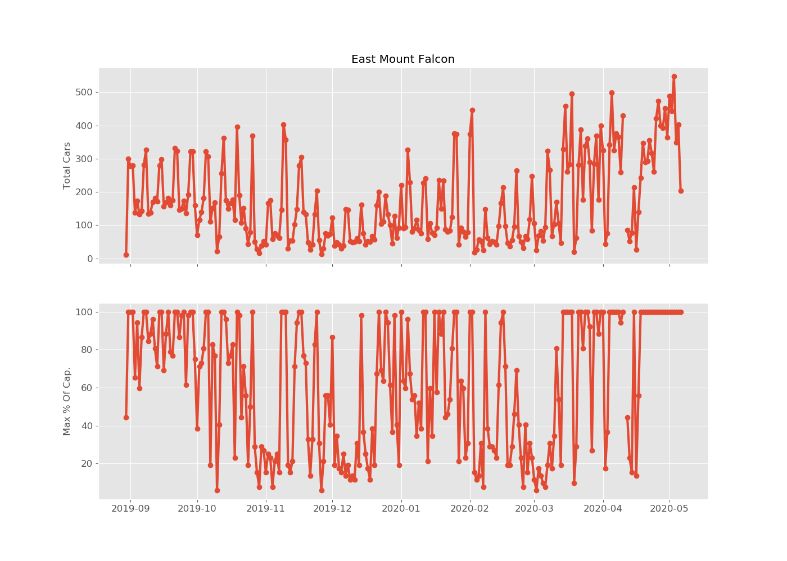
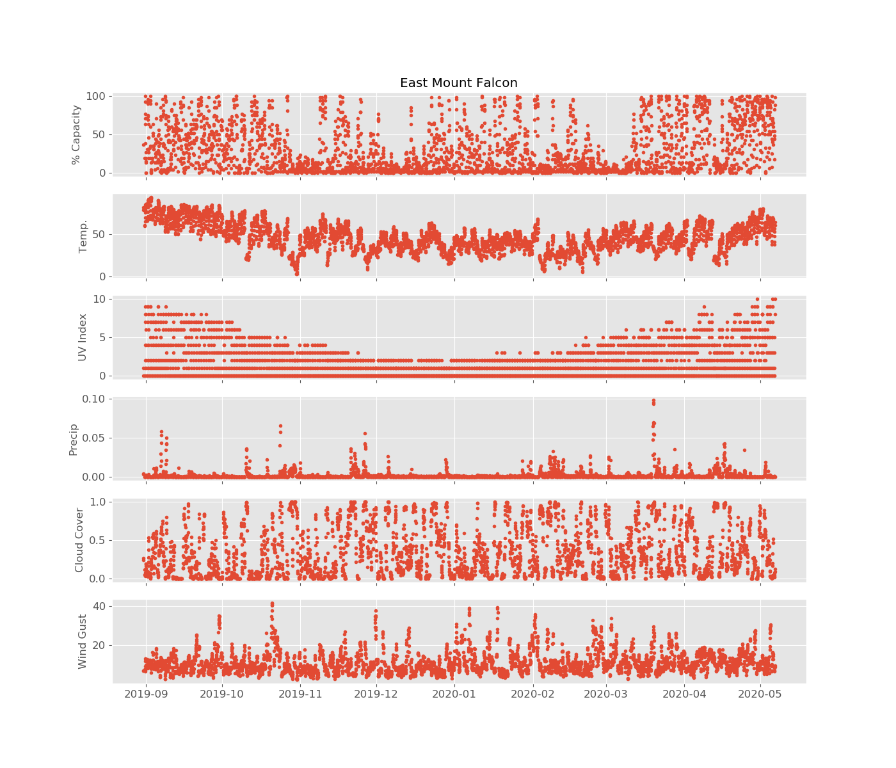
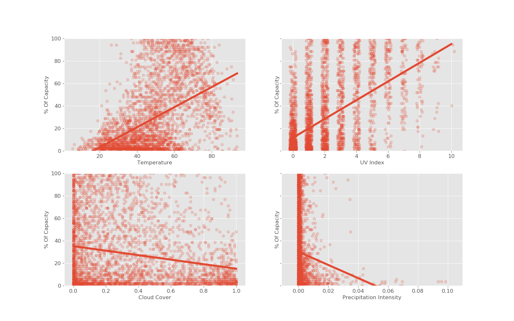
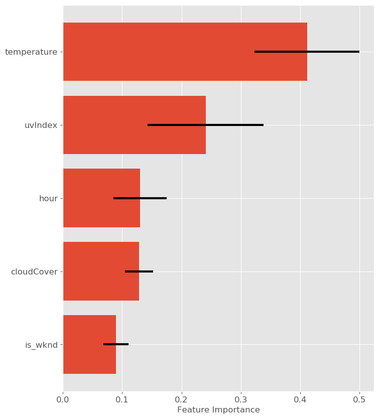
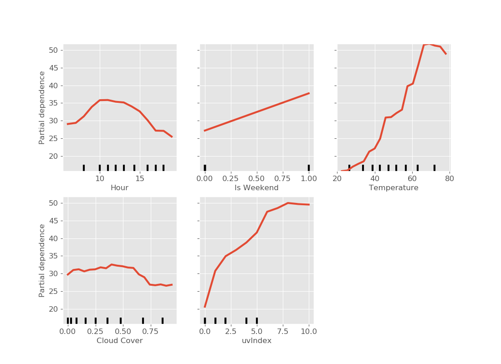

# Predicting Trailhead Parking Usage and Capacity at JeffCo Open Space Trailheads

# Introduction
I decided to build a model to predict parking lot % capacity (ie number of spots taken divided by total number of spots) at [Jefferson County Open Space](https://www.jeffco.us/open-space) trailheads in Colorado. This would be useful to:
- Hikers: When is the best time to go for a hike? Will there be parking available? 
- Open Space managers: How should we plan/allocate resources among the parks?

# Data

## LotSpot Parking Data
The data was shared by [Lot Spot](https://lotspot.co/), which JeffCo Open Space has contracted with since August 2019 to monitor parking at seven of their popular trailheads: 
- East [Mount Falcon](https://www.jeffco.us/1332/Mount-Falcon-Park)
- West Mount Falcon
- East [Three Sisters](https://www.jeffco.us/980/Alderfer-Three-Sisters-Park)
- West Three Sisters
- East [White Ranch](https://www.jeffco.us/1437/White-Ranch-Park)
- [Lair o' the Bear](https://www.jeffco.us/1254/Lair-o-the-Bear-Park)
- [Mount Galbraith](https://www.jeffco.us/1335/Mount-Galbraith-Park)

A camera located at the entrance to the parking lot detects when a vehicle enters or exits the lot. The LotSpot data contains a timestamp, # spaces in use, whether a car entered/exited, and % capacity of the lot. The timestamps are not evenly spaced (there is a datapoint whenever a car enters/exits a lot), so the raw data was resampled to a regularly spaced timeseries (1 hr intervals) for analysis and modeling. The time range of the data was from 2019-08-30 to 2020-05-06. 

Given the time constraints, I chose to first focus on a single park: **East Mount Falcon**. This is one of my personal favorites, had very few data gaps, and I know from experience can reach capacity. 

## Weather Data
[Powered by Dark Sky](https://darksky.net/poweredby/)
Historical weather data was obtained from the [Dark Sky API](https://darksky.net/dev/docs) for the time period of the LotSpot observations. The API takes a location (lat/lon) and returns both daily and hourly observations for the date requested. The data contains many fields; for the purpose of this analysis I was interested in the following:
- Temperature
- UV Index
- Cloud Cover
- Precipitation Intensity
- Wind Gust

# EDA

## Timeseries of total visitors(cars) per day
* A little bit of seasonal pattern, but not as much as expected.
* Note general increase after March 2020 - likely Covid-19 related, though can't be sure.

## Hourly Pattern

## Daily Pattern
* Signficant difference between weekdays/weekends

## Weather Timeseries

## Percent Capacity Vs. Weather

# Modeling

## Target
- Hourly Percent Capacity of Parking Lot (0-100)

## Features
- Day of week: Converted into Is-Weekend binary category.
- Temperature
- UV Index
- Cloud Cover
- Precipitation Intensity
- Hour of day - turned into dummy variables.

## Train/test split
- Use only pre-Covid19 data (before March 1, 2020)
- Use only hours 6am to 8pm
- 80/20 Train/Test Split
- Train and tune model on training data, then evaluate on test-set.
- Measure performance by R^2 and RMSE

## Baseline Model: Predict the mean
* Test-set RMSE : 28.9

## Random Forest

### Default Parameters

* Looks like default model is overfitting on training data

Performance:
* Train-set R^2 : 0.95
* Test-set R^2  : 0.54
* Test-set RMSE : 19.5

### Tuned w/ GridSearchCV

Performance:
* Train-set R^2 : 0.75
* Test-set R^2  : 0.64
* Test-set RMSE : 17.2

Best Parameters:
* n_estimators : 100
* max_depth : 10
* max_features : 'log2'
* min_samples_split : 10 

### Feature Importance
* Weather variabes and day of week most important

### Partial Dependence Plot
* Temperature shows generally positive dependence. Note breaks around freezing and around 55 degrees. What happens at higher temps?
* Cloud cover shows weaker negative trend, and there appears to be a larger negative shift at values > 0.5 .
* Precipitation Intensity shows slight negative trend, but a lot weaker than I expected.
* UV Index: Big break at value of ~2.

# Results/Conclusions
- A random forest model predicts hourly parking lot % capacity with R^2 of 0.64 and RMSE of 17.2 .
- Weather is really important!
- Need more data: Observe all seasons and weather conditions, as well as be able to isolate Covid-19 effects.

# If I had more time...
- Look at different parks
- More features (snow storms, holidays, etc.)
- Weather observed vs. forecasted?
- Weather variability by location
- Also predict # visitors, probability of lot being full, or waiting times.

# Credits/Acknowledgments
* Thanks to Hunter Berge and Connor McCormick at [Lot Spot](https://lotspot.co/) for sharing their data.
* Thanks to the Galvanize instructional team (Frank, Kayla, Mike) and capstone group for feedback and support.

