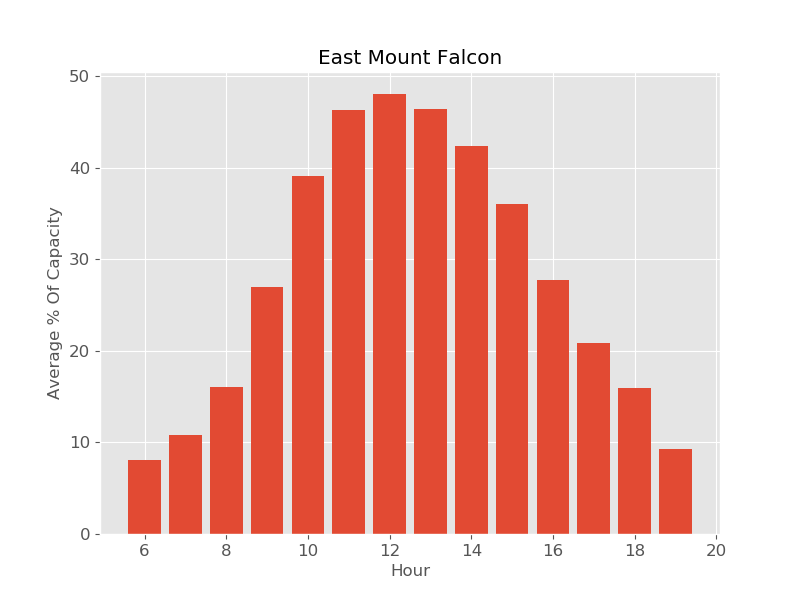

# Predicting Trailhead Parking Usage and Capacity at JeffCo Open Space Trailheads

# Introduction
I propose to build a model to predict parking lot capacity at [Jefferson County Open Space](https://www.jeffco.us/open-space) trailheads in Colorado. This would be useful to:
- Hikers: When is the best time to go for a hike? Will there be parking available? 
- Open Space managers: How should we plan/allocate resources among the parks?

This takes on added importance in the time of Covid-19, with the goal of maintaining adequate social distancing on trails. 

# Data

## LotSpot Parking Data
The data was shared by [Lot Spot](https://lotspot.co/), which JeffCo Open Space has contracted with since August 2019 to monitor parking at seven of their popular trailheads: 
- East [Mount Falcon](https://www.jeffco.us/1332/Mount-Falcon-Park)
- West Mount Falcon
- East [Three Sisters](https://www.jeffco.us/980/Alderfer-Three-Sisters-Park)
- West Three Sisters
- East [White Ranch](https://www.jeffco.us/1437/White-Ranch-Park)
- [Lair o' the Bear](https://www.jeffco.us/1254/Lair-o-the-Bear-Park)
- [Mount Galbraith](https://www.jeffco.us/1335/Mount-Galbraith-Park)

 A camera located at the entrance to the parking lot detects when a vehicle enters or exits the lot. The LotSpot data contains a timestamp, # spaces in use, whether a car entered/exited, and % capacity of the lot. The timestamps are not evenly spaced (there is a datapoint whenever a car enters/exits a lot), so the raw data was resampled to a regularly spaced timeseries (1 hr intervals) for analysis and modeling. The time range of the data was from 2019-08-30 to 2020-05-06. 

Given the time constraints, I chose to first focus on a single park: East Mount Falcon. 

## Weather
[Powered by Dark Sky](https://darksky.net/poweredby/)
- Temperature
- UV Index
- Cloud Cover
- Precipitation

# EDA

- Timeseries of total visitors(cars) per day. Note coronavirus start?

- Hourly Patterns

- Daily Patterns

# Modeling

## Features
- Day of week (or isweekend)

## Train/test split

- 

## Random Forest

- Performace metrics

- Feature importance plot

- Partial dependence plot

# Results/Conclusions
- Weather is really important!
- Covid-19 complications
- Need more data!

# If I had more time...
- Look at different parks
- Weather observed vs. forecasted?
- Weather variability 

